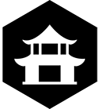

# Templates

__

Dotnet templates collection

| Templates                                                                                                                  ||
|:---------------------------------------------------------------------------------------------------------------------------|:-----:|
| [BullseyeBuild.Template](https://github.com/carlesdavila/Templates/tree/main/BullseyeBuild)   |__|
| [ServiceApi.Template](https://github.com/carlesdavila/Templates/tree/main/ServiceApi) |__|

---

[Temple](https://thenounproject.com/icon/temple-2623300/) by [Xinh Studio](https://thenounproject.com/xinhstudio/) from [the Noun Project](https://thenounproject.com/) 